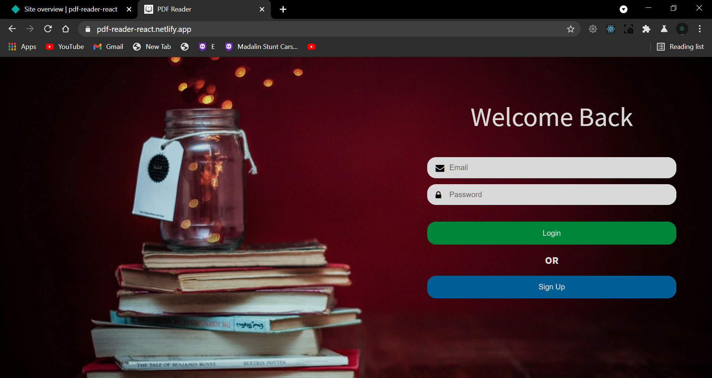
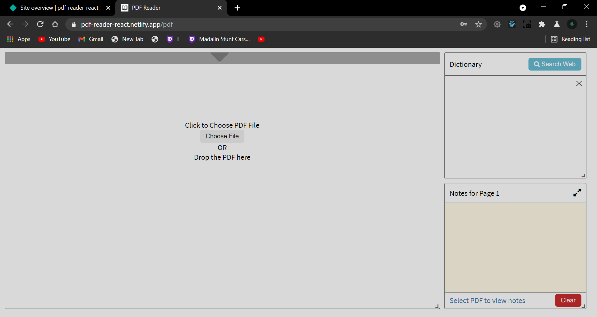
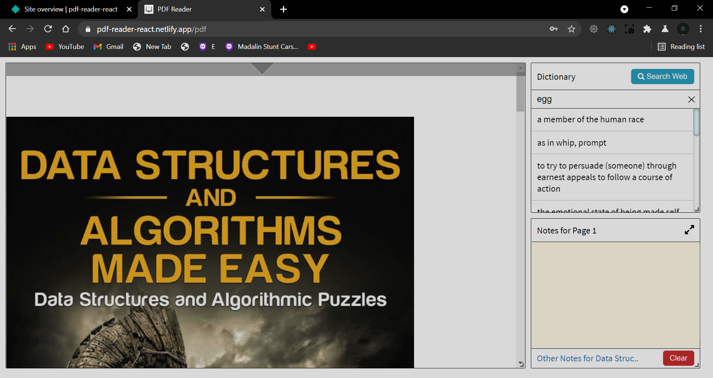
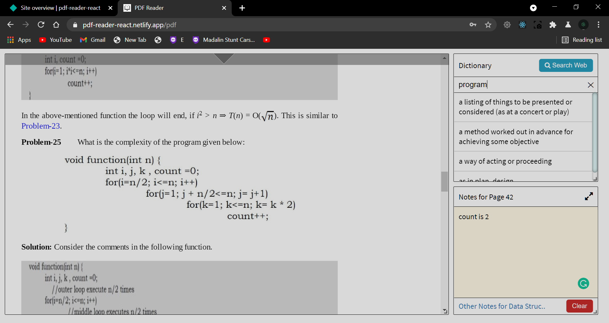

Link -
https://pdf-reader-react.netlify.app

Features -

- Read PDF File
- Dictionary window
- Note making for all your books
- Page specific notes
- Select word (double click word) in PDF to autofill dictionary input
- Keep track of notes of all your books

