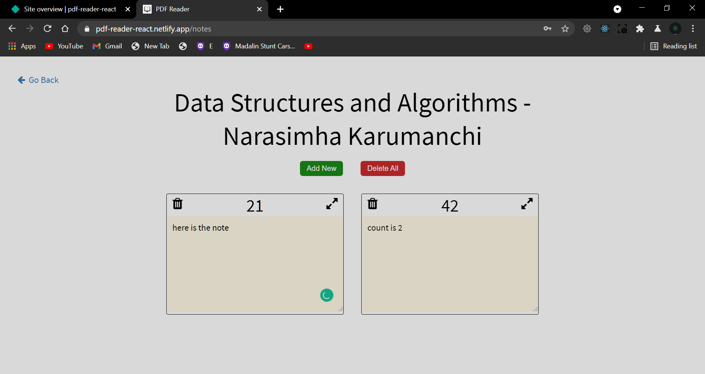

Link -
https://pdf-reader-react.netlify.app

Features -
Read PDF File\n
Dictionary window\n
Note making for all your books\n
Page specific notes\n
Select word (double click word) in PDF to autofill dictionary input\n
Keep track of notes of all your books\n

